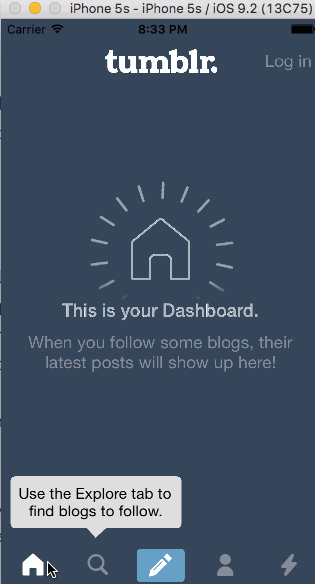

# HW4CodePathTumblr

Homework 4 CodePath: Tumblr Project

This is an iOS demo that creates an example app using Swift to create animations and gestures based on an example app (Tumblr).  I utilized the example step by step Tutorials in the [CodePath Week 4 Project Folder] (http://courses.codepath.com/courses/ios_for_designers/unit/4#!assignment) to create this app.  

Time spent: ~8 hours developing required pieces

Completed user stories:
* [x] User can tap on a custom Tab Bar controller by tapping on Home, Search, Account, or Trending should show the respective screen and highlight the tab bar button.
* [x] User can tap on the compose button to modally present the compose screen with animating compose options.
* [x] Optional: Compose screen is faded in while the buttons animate in.
* [x] Optional: Login button should show animate the login form over the view controller.
* [x] Optional: Discover bubble should bob up and down unless the SearchViewController is tapped.

GIF created with [LiceCap](http://www.cockos.com/licecap/).
